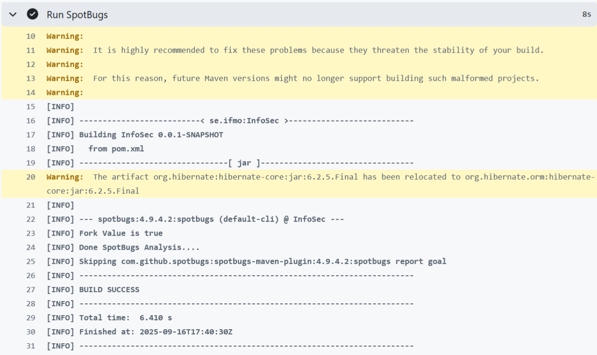
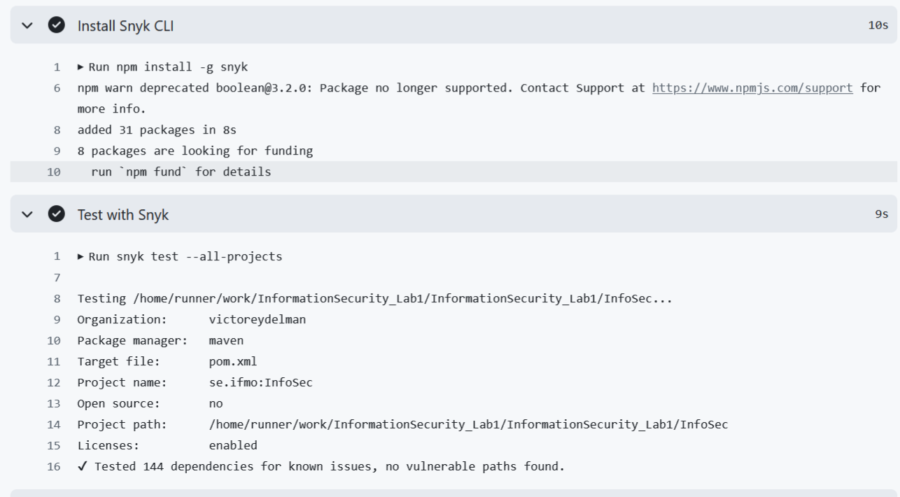

# Работа 1: Разработка защищенного REST API с интеграцией в CI/CD

## Описание проекта и API:

Проект из себя представляет backend-приложение на Java/Spring Boot.
Его API позволяют аутентифицироваться пользователю, а также в случае аутентификации получить список пользователей и сменить свой пароль.

Для этого предоставлены 3 API:
1) POST /auth/login - метод для аутентификации пользователей, позволяет зарегистрироваться новым пользователя и войти старым по логин и паролю
2) GET /api/data - метод для получения списка пользователей, доступен только аутентифицированным пользователям.
3) PUT /api/updatePassword - метод для обновления пароля пользователя, доступен только аутентифицированным пользователям.

Сервер находиться на порту 3434

## Описание мер защиты:

1) Защита от SQLi:
Для этого используется ORM Hibernate и не используется конкатенация строк. 
Реализация [UserService](https://github.com/VictorEydelman/InformationSecurity_Lab1/blob/main/InfoSec/src/main/java/se/ifmo/InfoSec/service/UserService.java)
2) Защита от XSS: Для этого экранирую все пользовательские данные, которые возвращаются в ответах API 
Реализация [функции для экранирования](https://github.com/VictorEydelman/InformationSecurity_Lab1/blob/main/InfoSec/src/main/java/se/ifmo/InfoSec/entities/Util/XSSUtil.java)
3) Защита от Broken Authentication:
   а) Пользователя выдаются JWT токены. [JWTService](https://github.com/VictorEydelman/InformationSecurity_Lab1/blob/main/InfoSec/src/main/java/se/ifmo/InfoSec/service/JWTService.java)
   б) Написан middleware, который проверяет JWT-токены на всех защищённых эндпоинтах.[SecurityFilter](https://github.com/VictorEydelman/InformationSecurity_Lab1/blob/main/InfoSec/src/main/java/se/ifmo/InfoSec/config/SecurityFilter.java)
   в) Пароли шифруются с помощью bcrypt. Реализация [класса шифрования и проверки bcrypt](https://github.com/VictorEydelman/InformationSecurity_Lab1/blob/main/InfoSec/src/main/java/se/ifmo/InfoSec/entities/Util/HashUtil.java)

# SAST/SCA:

1) Для SAST подключил spotbugs

Скриншот запуска spotbugs

2) Для SCA подключил Snyk

Скриншот запуска Snyk
